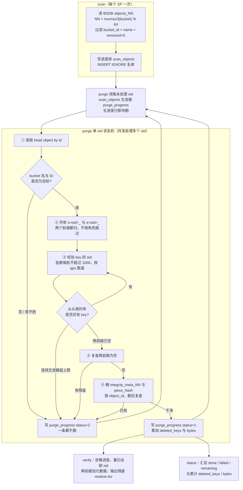

# limewire-purge

按 SP 部署的物理数据清理工具：从本 SP 的索引数据库获取指定 Greenfield bucket 的 object ID，
逐个查链确认归属，再删除本 SP 对应的 S3 piece 和本地元数据，用独立 MySQL 表记录进度。

**这是不可逆的物理删除，不是链上的 DeleteObject / DiscontinueObject。** 工具不发送交易，
不删除链上 object/bucket，不停止计费，也不自动停用 challenge。链上对象可能仍为 SEALED，
但文件已经无法正常读取。仅用于已确认废弃、已授权清理的 bucket。

## 工作流程

每个 SP 各跑一份，同一份代码只有配置不同。`scan` 从 BSDB 导出名单，`purge` 逐 oid 处理并把结果写进度库，`verify` / `status` 只读复查与汇总。



护栏：`purge` / `verify` 启动先查 `GetBucketVersioning`，版本控制 Enabled/Suspended 或查不到即中止；`PieceStore.Shards > 1` 直接拒绝。中断后原命令重跑即续，失败项用 `--retry-failed` 单独重试。

## 命令详解

四个子命令碰的数据库不同：`scan` 读 BSDB、写进度库；`purge` 读进度库、查链、删 S3、删 SpDB，把结果写回进度库；`verify` 读进度库、只读 S3 和 SpDB；`status` 只读进度库。

| 命令 | BSDB | 链 RPC | S3 物理桶 | SpDB | 进度库 |
|---|---|---|---|---|---|
| `scan` | 读 | — | — | — | 写 `scan_objects` |
| `purge` | — | 读 | 列举 + 删除 | 删除 | 读名单，写 `purge_progress` |
| `verify` | — | — | 只读列举 | 只读 | 读名单，写 residue 文件 |
| `status` | — | — | — | — | 只读汇总 |

### `scan` — 从 BSDB 导出名单

把目标 bucket 的全部 objectID 从**本 SP 的 BSDB 索引库**读出来，写进**工具自己的进度库** `scan_objects` 表。只读 BSDB，不删任何数据。

涉及两个库，指定方式不同：

- BSDB（数据源）：不在命令行直接给，从 `--config` 的 TOML `[BsDB]` 段读，可被 `BS_DB_USER/PASSWORD/ADDRESS/DATABASE` 环境变量覆盖。
- 进度库（写入目标）：用 `--progress-dsn` 直接给完整 MySQL DSN。

执行步骤：

1. 解析 `--config`，按 `objects_NN`（`NN = murmur3(桶名) % 64`）定位 BSDB 中该桶所在的分表。
2. 先跑一次 `COUNT(*)` 作为连通性与数量心跳（`--count-only` 时到此结束，不写进度库）。
3. 按源表主键 `id` 游标分批（`--batch`，默认 5000）拉取，筛选 `bucket_id + bucket_name + removed=0`，`INSERT IGNORE` 进 `scan_objects`。

| 参数 | 默认 | 说明 |
|---|---|---|
| `--config` | 必填 | SP TOML，读 `[BsDB]` |
| `--progress-dsn` | 必填（`--count-only` 时不需要） | 进度库 DSN |
| `--bucket` | `limewire` | 逻辑 bucket 名，建议显式指定 |
| `--bucket-id` | `42268` | 十进制 bucket ID，建议显式指定 |
| `--batch` | `5000` | 每次查 BSDB 的行数，正整数；不是 S3 删除批大小 |
| `--count-only` | `false` | 只打印 BSDB 计数，不写库、不建表 |

```bash
# 只数一下（只连 BSDB）
./limewire-purge scan --config ~/.local/sp0/config.toml \
  --bucket purge-test --bucket-id <ID> --count-only

# 导入名单（连 BSDB + 进度库）
./limewire-purge scan --config ~/.local/sp0/config.toml \
  --progress-dsn 'root:<pw>@tcp(127.0.0.1:3306)/limewire_purge_sp0' \
  --bucket purge-test --bucket-id <ID> --batch 5000
```

`INSERT IGNORE` 使重跑安全：补入新 oid，不覆盖已有行、不清进度。日志里的 `rows written` 是本次提交的行数（含被忽略的重复），不等于新增行数。名单是对象数，不是 S3 key 数——一个对象可能对应多段或多个 EC 分片。

### `purge` — 逐对象删除

从进度库领取还没处理的 oid，逐个删除本 SP 对应的 S3 piece 和 SpDB 元数据，结果写回进度库。这是不可逆物理删除，**没有二次确认，`--dry-run` 默认关闭**。

碰四个地方：进度库（读名单 + 写结果）、链 RPC（每个 oid 删前查归属）、S3 物理桶（列举 + 批删）、SpDB（删元数据）。链和 S3 的指定：

- 链：`--chain-rpc`（带协议的 CometBFT RPC URL，非 gRPC、非 REST）+ `--chain-id`；工具不从 SP TOML 读链配置。
- S3 桶：从 `--config` 的 `[PieceStore.Store]` 读（`Storage` / `BucketURL` / `IAMType`），`BUCKET_URL` 环境变量优先；云凭证走 `AWS_ACCESS_KEY`/`AWS_SECRET_KEY`（AKSK）或 SDK 默认链（SA/IRSA）。

启动时的硬校验，任一不过直接退出：① 桶未开版本控制；② 链上 bucket ID 与 `--bucket-id` 一致；③ `scan_objects` 非空。

领取规则：普通模式领取「进度库里没有记录」的 oid（未处理或中断未落库）；`--retry-failed` 只领 `status=2` 的失败项。`--concurrency` 个 worker 并发，各处理一个 oid。

单个 oid 的执行顺序：

1. 查链确认对象归属目标 bucket；查不到或不符 → 记失败，一条都不删。
2. 分别列举 `s<oid>_`、`e<oid>_` 两个前缀，不按 primary/secondary 角色跳过。
3. 每批 ≤1000 个 key 用 `DeleteObjects` 批删，校验逐 key 结果；每轮从前缀开头重列，删空为止（大对象即「列 1000 → 删 → 再列」的流式循环，不会一次性读全部 key）。
4. 两个前缀复查为空后，按 `object_id` 删本 SP 的 `integrity_meta_NN` 与 `piece_hash`，再复查无残留。
5. 写进度：成功 `status=1` 并累加删除量；任一步失败 `status=2` 并记原因，已删部分仍计入。

运行时日志，用于判断是否卡住：领到对象时打 `oid=X start`；每一轮批删后打一行 `oid=X s55_: round N listed=… deleted=… (prefix total keys=… bytes=…)`，大对象会连续出现多轮；每 30 秒一条总进度心跳 `progress: n/total processed, failed=…, keys=…, elapsed=…`；对象完成或失败时打 `[n/total] oid=X done|FAILED …`。

| 参数 | 默认 | 说明 |
|---|---|---|
| `--config` | 必填 | SP TOML，读 `[PieceStore.Store]` 与 `[SpDB]` |
| `--progress-dsn` | 必填 | 进度库 DSN |
| `--bucket` / `--bucket-id` | `limewire` / `42268` | 目标桶，建议显式指定 |
| `--chain-rpc` | `https://greenfield-chain.bnbchain.org:443` | CometBFT RPC URL，本地如 `http://127.0.0.1:26657` |
| `--chain-id` | `greenfield_1017-1` | 与目标链匹配 |
| `--dry-run` | `false` | 只查链 + 列举命中，不删、不写进度 |
| `--concurrency` | `8` | 并发处理的 oid 数（不是单批 key 数） |
| `--qps` | `50` | S3 列举/删除限速；不含链查询和 SDK 内部重试 |
| `--max-retry` | `10` | 单 oid 连续无进展的退避重试轮数上限（列举错误、删除请求错误、整批 key 全失败都计入；一轮有 key 删成功即清零） |
| `--retry-failed` | `false` | 只重试 `status=2` 的对象 |

```bash
# dry-run：先看命中多少 key，不删
./limewire-purge purge --config ~/.local/sp0/config.toml \
  --progress-dsn 'root:<pw>@tcp(127.0.0.1:3306)/limewire_purge_sp0' \
  --bucket purge-test --bucket-id <ID> \
  --chain-rpc http://127.0.0.1:26657 --chain-id greenfield_9000-121 \
  --concurrency 1 --qps 5 --dry-run

# 正式删（去掉 --dry-run）
./limewire-purge purge --config ~/.local/sp0/config.toml \
  --progress-dsn 'root:<pw>@tcp(127.0.0.1:3306)/limewire_purge_sp0' \
  --bucket purge-test --bucket-id <ID> \
  --chain-rpc http://127.0.0.1:26657 --chain-id greenfield_9000-121 \
  --concurrency 1 --qps 5

# 只重试之前失败的
./limewire-purge purge ... --retry-failed
```

中断后原命令重跑即续：重列前缀以实际剩余为准，不依赖 segment 游标。并发和 QPS 的示例值只是低负载起点，需按本 SP 延迟、错误率和其他租户负载调整。每个 SP 用各自的 `--config` 和独立进度库，不要多个 SP 共用一个进度库。

### `verify` / `status` — 复查与汇总

`verify` 忽略进度状态，对 `scan_objects` 全部 oid 重新只读列举两个前缀并检查 SpDB 元数据，把残留写到 `--out`（默认 `residue.tsv`，格式 `oid<TAB>where<TAB>count`），有残留时返回非零退出码。它不查链、不按 `--bucket` 重新过滤，检查范围由进度库和 SP 配置决定。`status` 只读进度库，打印 `done / failed / remaining` 和累计删除量，`--failures` 控制显示多少条最近失败原因。

```bash
./limewire-purge verify --config ~/.local/sp0/config.toml \
  --progress-dsn 'root:<pw>@tcp(127.0.0.1:3306)/limewire_purge_sp0' --qps 5 --out ./residue-sp0.tsv

./limewire-purge status --progress-dsn 'root:<pw>@tcp(127.0.0.1:3306)/limewire_purge_sp0' --failures 50
```

## 1. 数据从哪里读，写到哪里

一个 `oid` 对应一个 Greenfield 链上 object，不是一个 S3 key；大对象可能对应数千个 key。
逻辑 bucket 名（`--bucket`）也不是 S3 物理桶名（SP 配置中的 `BucketURL`）。

| 数据源 | 配置来源 | 工具的操作 |
|---|---|---|
| SP 的 BSDB（block-syncer 索引库） | TOML `[BsDB]` / 环境变量 | `scan` 只读目标 bucket 的对象列表，不修改源表 |
| 工具的进度数据库 | `--progress-dsn` | `scan` 写名单，`purge` 写完成/失败结果，`status` 读汇总 |
| SP 的 SpDB（piece 元数据库） | TOML `[SpDB]` / 环境变量 | 物理数据清空后，删除目标 oid 的 `integrity_meta_NN` 和 `piece_hash`；`verify` 只读复查 |
| SP 的 S3 / MinIO 物理桶 | TOML `[PieceStore.Store]` / `BUCKET_URL` | 按 oid 前缀列举、批量删除、复查 |
| Greenfield 链 | `--chain-rpc`、`--chain-id` | `purge` 启动时核对 bucket ID；每个 oid 删除前查询对象所属 bucket |

`scan` **会落库，但不是自动写入本机 SQLite**：写入的是 `--progress-dsn` 指定的 MySQL，
它可以在本机，也可以在远端，或与 SP 数据库共用 MySQL 实例。

**每个 SP、每次独立清理任务使用独立的进度库**，例如 `limewire_purge_sp0`、`limewire_purge_sp1`。
不要将进度表建到 SP 的业务库，不要让多个 SP 共用同一进度库；当前没有 SP/任务身份绑定校验，
误用会把其他 SP 的 DONE 当成本 SP 已完成。同一任务也不要并发启动多个 `purge` 进程。

### 两张进度表

| 表 | 关键字段 | 含义 |
|---|---|---|
| `scan_objects` | `object_id`（主键）、`payload_size`、`status`、`version` | 扫描获得的 oid 白名单；这里的 status 是链对象状态快照，如 SEALED，不是删除进度 |
| `purge_progress` | `object_id`（主键）、`status`、`deleted_keys`、`deleted_bytes`、`fail_reason`、`updated_at` | 每个 oid 一条处理结果：`1` 完成，`2` 失败；没有记录表示未处理或中断后尚未落库 |

数据库需提前创建；工具自动执行 `CREATE TABLE IF NOT EXISTS`，不会自动创建数据库。
重跑 `scan` 使用 `INSERT IGNORE`：补入新 oid，但不覆盖已有行、不清空进度，也不刷新已有对象的字段。

### 核心表结构（与当前代码一致）

以下 SQL 对应 `internal/progress/progress.go` 的 `EnsureSchema()`，供检查表结构使用；
正常运行由工具自动建表，无需手动重复执行。这两张表都位于 `--progress-dsn` 指定的数据库。

#### `scan_objects`：待清理对象名单

```sql
CREATE TABLE IF NOT EXISTS scan_objects (
    object_id    BIGINT UNSIGNED NOT NULL PRIMARY KEY,
    payload_size BIGINT UNSIGNED NOT NULL,
    status       VARCHAR(16) NOT NULL,
    version      INT NOT NULL DEFAULT 0
);
```

| 字段 | 类型 / 约束 | 含义 |
|---|---|---|
| `object_id` | `BIGINT UNSIGNED`，主键 | Greenfield 链上 object ID；一行一个对象，不按 piece 分行 |
| `payload_size` | `BIGINT UNSIGNED NOT NULL` | 从 BSDB 读取的逻辑对象大小，单位 byte；不是本 SP 的物理占用量 |
| `status` | `VARCHAR(16) NOT NULL` | BSDB 对象状态快照，写入前去掉 `OBJECT_STATUS_` 前缀，例如 `SEALED`、`CREATED`；不表示删除成功或失败 |
| `version` | `INT NOT NULL DEFAULT 0` | BSDB 中的 Greenfield 对象版本；不是 S3 `VersionId`，删除时仍扫描整个 oid 前缀 |

#### `purge_progress`：对象处理结果

```sql
CREATE TABLE IF NOT EXISTS purge_progress (
    object_id     BIGINT UNSIGNED NOT NULL PRIMARY KEY,
    status        TINYINT NOT NULL,
    deleted_keys  INT UNSIGNED NOT NULL DEFAULT 0,
    deleted_bytes BIGINT UNSIGNED NOT NULL DEFAULT 0,
    fail_reason   TEXT NULL,
    updated_at    TIMESTAMP NOT NULL DEFAULT CURRENT_TIMESTAMP
                  ON UPDATE CURRENT_TIMESTAMP,
    KEY idx_status (status)
);
```

| 字段 | 类型 / 约束 | 含义 |
|---|---|---|
| `object_id` | `BIGINT UNSIGNED`，主键 | 对应 `scan_objects.object_id`，当前没有数据库外键约束 |
| `status` | `TINYINT NOT NULL` | `1 = DONE`：物理数据与元数据复查通过；`2 = FAILED`：本次处理失败 |
| `deleted_keys` | `INT UNSIGNED NOT NULL DEFAULT 0` | 已落库尝试中，S3 返回删除成功的 key 数之和；失败尝试中已成功删除的部分也计入 |
| `deleted_bytes` | `BIGINT UNSIGNED NOT NULL DEFAULT 0` | 上述成功 key 在列举时的大小之和，单位 byte；中断未落库时可能少计 |
| `fail_reason` | `TEXT NULL` | 最近一次失败原因，当前代码写入前最多保留 4000 字节；重试成功后置 NULL |
| `updated_at` | `TIMESTAMP`，自动默认/更新 | 该进度行的数据库更新时间，不是实时运行心跳 |
| `idx_status` | `status` 普通索引 | 用于按处理状态检索，不保证任务互斥 |

两表通过 `object_id` 关联；状态选择规则如下：

| 名单中存在，进度表中… | 含义 | 哪个命令会处理 |
|---|---|---|
| 无对应行 | 未开始，或处理中/中断后尚未写入结果；不能仅凭无行区分 | 普通 `purge` |
| `status = 2` | 上次处理失败，可能已经删掉部分 key | `purge --retry-failed` |
| `status = 1` | 已记录完成 | purge 跳过；`verify` 仍会复查 |

当前没有 `PENDING/RUNNING` 行、批次游标、`sp_id`、`bucket_id` 或 `task_id` 字段。
`Done/Fail` 使用 UPSERT 更新同一行并累加删除量；这些表是当前结果和累计量，不是逐次尝试的历史日志。

## 2. 运行前提

- 每个 SP 使用自己的配置、云身份、物理桶、SpDB 和进度库。可以运行在该 SP 的 pod 内，
  或具备相同存储访问身份和网络可达性的环境中；不需要链上交易私钥。
- 清理前由运维确认 challenge/attestation 风险已在所需范围内处置；只停本地一个进程不能视为全网已停。
  链上仍保留对象时，不能因本工具完成就恢复相关抽检。工具不会执行这些运维操作。
- 停止目标数据的上传、更新、迁移和恢复等可能重新写入 piece 的流程，确保扫描及删除期间目标集合稳定。
  不影响其他租户的读写是执行前提，需要先在测试环境验证，再低并发、小流量试运行。
- 当前仅支持 S3 / MinIO，`PieceStore.Shards > 1` 会直接拒绝，不会遍历多个物理分片桶。
- `purge`（含 dry-run）和 `verify` 会查询版本控制状态：Enabled、Suspended 或查询失败均拒绝继续。
  当前不支持按 `VersionId` 清理云历史版本；不要用“暂停版本控制”绕过检查。
- BSDB 需 SELECT 权限；SpDB 正式清理需 SELECT、DELETE；进度库需 SELECT、INSERT、UPDATE、CREATE；
  S3 需列举及查询版本控制的权限，正式清理另需删除权限。权限应限定到授权目标。

## 3. 构建

当前 Makefile 固定 Go `1.21.13`，SDK 的 BLS 依赖需要 CGO 和 C 编译器。
推荐直接在目标 Linux amd64 构建环境编译：

```bash
make build       # 输出 ./limewire-purge
make test        # go vet + 全量单元测试
make test-logic  # 仅 pieceop / purge / spconfig，不覆盖 SDK 和真实存储集成
```

`make linux` 输出 `limewire-purge-linux-amd64`，但跨平台执行需要配置 Linux C 交叉工具链。
不能使用 `CGO_ENABLED=0` 构建当前 SDK 依赖。构建完成后还需在目标运行环境验证二进制可启动。

## 4. 配置

`--config` 指向本 SP 的现有 TOML。工具只读取所需字段，不启动 SP 服务。
以下仅为本地测试示意，不应覆盖正在运行的 SP 配置：

```toml
[BsDB]
User = "bs_reader"
Passwd = "REPLACE_ME"
Address = "127.0.0.1:3306"
Database = "bsdb_sp0"

[SpDB]
User = "sp_purger"
Passwd = "REPLACE_ME"
Address = "127.0.0.1:3306"
Database = "spdb_sp0"

[PieceStore]
Shards = 0

[PieceStore.Store]
Storage = "minio"
BucketURL = "http://127.0.0.1:9000/sp0"
IAMType = "AKSK"
```

环境变量优先于 TOML 中对应字段：

| 用途 | 环境变量 |
|---|---|
| BSDB 连接 | `BS_DB_USER`、`BS_DB_PASSWORD`、`BS_DB_ADDRESS`、`BS_DB_DATABASE` |
| SpDB 连接 | `SP_DB_USER`、`SP_DB_PASSWORD`、`SP_DB_ADDRESS`、`SP_DB_DATABASE` |
| 物理桶 URL | `BUCKET_URL` |
| AKSK 凭证 | `AWS_ACCESS_KEY`、`AWS_SECRET_KEY`，可选 `AWS_SESSION_TOKEN` |
| SA / IRSA 凭证 | 使用 AWS SDK 默认凭证链，例如 `AWS_ROLE_ARN`、`AWS_WEB_IDENTITY_TOKEN_FILE` |

云凭证不从上述 TOML 读取。使用现有凭证注入机制，不要将真实密码或 access key 提交到仓库。
进度 DSN 含密码，传入命令行也可能被进程列表或终端记录暴露，应使用受控运行环境。

## 5. 推荐执行顺序

### 5.1 准备独立进度库与参数

由数据库管理员创建本 SP 的进度库并授权，例如：

```sql
CREATE DATABASE limewire_purge_sp0;
```

以下示例针对本地测试链。替换实际的 bucket ID、chain ID、配置路径及 DSN；
正式环境不要照抄测试参数，也不要依赖命令的主网默认值。

```bash
PURGE_CONFIG='/path/to/sp0/config.toml'
PURGE_DSN='purger:REPLACE_ME@tcp(127.0.0.1:3306)/limewire_purge_sp0'
PURGE_BUCKET='purge-test'
PURGE_BUCKET_ID='123'                   # 替换成链上确认过的 bucket ID
PURGE_RPC='http://127.0.0.1:26657'       # CometBFT RPC，不是 REST 1317 或 gRPC 端口
PURGE_CHAIN_ID='greenfield_9000-121'     # 替换成本地链的实际 chain ID
```

### 5.2 只统计，然后导入名单

```bash
# 只查 BSDB 数量；不需要进度 DSN，不创建表，不删除数据。
./limewire-purge scan --config "$PURGE_CONFIG" \
  --bucket "$PURGE_BUCKET" --bucket-id "$PURGE_BUCKET_ID" --count-only

# 按批读取 BSDB，写入进度库 scan_objects。
./limewire-purge scan --config "$PURGE_CONFIG" --progress-dsn "$PURGE_DSN" \
  --bucket "$PURGE_BUCKET" --bucket-id "$PURGE_BUCKET_ID" --batch 5000

./limewire-purge status --progress-dsn "$PURGE_DSN"
```

扫描读取 `objects_NN`，其中 `NN = murmur3(bucketName) % 64`，筛选 bucket ID、bucket 名及 `removed=0`，
按源表主键分页。它不是全链枚举，也不包含已标记 removed 的对象；BSDB 必须足够新且覆盖目标范围。

在目标不变的前提下，核对 BSDB 数量、本次完整读取数量、`scan_objects` 总数及已知业务清单。
重复扫描时日志 `rows written` 是本次提交插入的行数，包含被 `INSERT IGNORE` 忽略的重复项，不等于新增行数。
**对象数不能直接与 S3 key 数相等比较**，一个对象可能有多段、多版本或 EC 分片。

### 5.3 dry-run

```bash
./limewire-purge purge --config "$PURGE_CONFIG" --progress-dsn "$PURGE_DSN" \
  --bucket "$PURGE_BUCKET" --bucket-id "$PURGE_BUCKET_ID" \
  --chain-rpc "$PURGE_RPC" --chain-id "$PURGE_CHAIN_ID" \
  --concurrency 1 --qps 5 --dry-run
```

dry-run 查链并列举命中 key，不删除 S3/SpDB 数据，也不写处理结果。
但连接进度库时仍会执行建表检查，因此不是完全无数据库写操作。
它与普通 purge 选择相同的未处理集合，已 DONE 的对象不会重新预览；`--retry-failed --dry-run` 只预览失败项。
dry-run 不能证明删除权限有效，也不能替代真实测试环境中的删除验证。

### 5.4 正式删除

完成名单、物理桶、权限和运维前提确认后，去掉 `--dry-run` 才执行删除。
**命令没有二次确认；dry-run 默认关闭。**

```bash
./limewire-purge purge --config "$PURGE_CONFIG" --progress-dsn "$PURGE_DSN" \
  --bucket "$PURGE_BUCKET" --bucket-id "$PURGE_BUCKET_ID" \
  --chain-rpc "$PURGE_RPC" --chain-id "$PURGE_CHAIN_ID" \
  --concurrency 1 --qps 5
```

上述并发和 QPS 仅为低负载起点，不是已验证的生产安全值，应根据本 SP 延迟、错误率及其他租户负载调整。

每个 oid 的执行顺序：

1. 查询链上对象所属 bucket；查链失败、不存在或归属不符，记录失败，不删除该 oid。
2. 在本 SP 配置的物理桶中，分别列举 `s<oid>_`、`e<oid>_`；不依据当前 primary/secondary 角色跳过任一前缀。
3. 校验 key 中的 oid，每批最多 1000 个 key，用 S3 `DeleteObjects` 批量删除并检查逐 key 结果。
4. 每轮从前缀起点重新列举剩余 key；持续失败则停止该 oid，保留元数据，其他 oid 继续处理。
5. 两个前缀再次确认为空后，按 oid 清理本 SP 的 integrity / piece_hash 元数据，并复查无残留。
6. 写入该 oid 的完成或失败结果。

小对象和大对象使用同一算法。某个前缀有 2500 个 key 时，分为最多 `1000 + 1000 + 500` 三批，
再列举为空才结束，不会启动 2500 个并发删除。下划线保证 `s123_` 不匹配 `s1234_`；
Greenfield 的 `_v<n>` key 后缀被同一前缀覆盖，与 S3 云版本控制不是一回事。

### 5.5 中断恢复与失败重试

单个 oid 内部先自愈：某一批删除失败（列举错误、删除请求错误、或整批 key 全部失败）时，退避后重新列举该前缀——列出来的正好只剩没删成功的部分——再删，最多连续 `--max-retry`（默认 10）轮无进展才把该 oid 记为 `status=2`，其间只打日志、不写进度表；一轮只要有 key 删成功，计数即清零。达到上限后保留该 oid 的元数据、继续处理其他 oid。跨命令的重试如下：

- 原参数重跑普通 `purge`：仅处理没有进度记录的 oid，跳过已完成和已记录失败项。
- `purge --retry-failed`：仅重试 `status=2` 的失败项，不会顺带处理未处理项。
- 中断可能留下未落库项，也可能留下已记录失败项；恢复时需要检查这两类，必要时分别运行。
- 重启后重新列举实际剩余 key，不依赖 segment 游标；已删除部分不必恢复后再删。
- `scan` 中断后可重跑补名单，但不会从持久化的源表游标继续，而是重新扫描并忽略重复 oid。

```bash
./limewire-purge purge --config "$PURGE_CONFIG" --progress-dsn "$PURGE_DSN" \
  --bucket "$PURGE_BUCKET" --bucket-id "$PURGE_BUCKET_ID" \
  --chain-rpc "$PURGE_RPC" --chain-id "$PURGE_CHAIN_ID" \
  --concurrency 1 --qps 5 --retry-failed
```

### 5.6 独立复查

```bash
./limewire-purge verify --config "$PURGE_CONFIG" --progress-dsn "$PURGE_DSN" \
  --qps 5 --out ./residue-sp0.tsv

./limewire-purge status --progress-dsn "$PURGE_DSN" --failures 50
```

`verify` 忽略 DONE/FAILED 状态，对 `scan_objects` 全部 oid 重新列举两个前缀，并检查 SpDB 元数据。
不删除业务数据，不修改完成状态，但仍会做进度表建表检查，并创建或覆盖 `--out` 文件。
它不查询链，也不使用 `--bucket` / `--bucket-id` 重新过滤名单；检查范围由进度库和 SP 配置决定。

残留报告无表头，格式为 `oid<TAB>where<TAB>count`，例如：

```text
123	s123_	5
456	metadata	1
```

`metadata=1` 表示存在元数据，不是精确行数；日志 `residue` 是残留条目数，不是残留对象数。
发现残留时 verify 返回非零退出码。

验收需同时确认：名单完整；`done=total`、`failed=0`；verify 的 `checked=total`、`residue=0`；
日志没有查链、存储或进度落库错误。每个 SP 分别验收，单个 SP 成功不代表全部副本已清理。

## 6. 参数速查

| 参数 | 命令 | 默认值 / 说明 |
|---|---|---|
| `--config` | scan / purge / verify | 必填 SP TOML 路径 |
| `--progress-dsn` | 除 count-only 外 | 必填独立 MySQL 进度库 DSN；status 不需要 config |
| `--bucket` | scan / purge | `limewire`，建议显式指定 |
| `--bucket-id` | scan / purge | `42268`，十进制，建议显式指定 |
| `--batch` | scan | `5000`，每次源库查询的行数，使用正整数；不是 S3 删除批大小 |
| `--count-only` | scan | `false`，只打印源库计数 |
| `--chain-rpc` | purge | `https://greenfield-chain.bnbchain.org:443`；使用带协议的 CometBFT RPC URL |
| `--chain-id` | purge | `greenfield_1017-1`；与目标链匹配，工具不从 SP TOML 读取链配置 |
| `--dry-run` | purge | `false`；只预览所选集合 |
| `--concurrency` | purge | `8`，同时处理的 oid 数，不是单批 key 数 |
| `--qps` | purge / verify | `50`，存储列举/删除路径的限速参数；不是链查询/MySQL 的统一限速，也不含 SDK 内部重试的精确请求计数 |
| `--max-retry` | purge | `10`，单 oid 连续无进展的退避重试轮数上限（列举错误、删除请求错误、整批 key 全失败都计入）；一轮删成功即清零，不是每类请求各自的重试次数 |
| `--retry-failed` | purge | `false`；开启后只选失败项 |
| `--out` | verify | `./residue.tsv`，会覆盖同名文件 |
| `--failures` | status | `20`，显示最近失败原因的条数 |

`status` 中 `remaining = total - done - failed`，表示尚无结果的对象数；
**remaining=0 不等于全部成功**，还要检查 failed。`deleted_keys/bytes` 累加已落库尝试的删除结果，
中断前未落库的删除量可能漏计，不是精确账单节省值。`scan Σ payload_size` 是逻辑对象大小，
不能直接当作本 SP 应释放的物理字节数。

## 7. 当前限制与实现边界

以下是当前实现的限制，不是已经具备的安全保障：

- 扫描尚无完成标记，且源库迭代尚缺 `rows.Err()` 检查；中途读取失败可能被当作扫描结束。
  正式执行前应修复，不能仅凭存在 `scan_objects` 或 `scan done` 日志认定名单完整。
- purge 的对象失败或进度写入失败尚未统一转为非零退出码，完成日志也可能先于落库。
  不能仅凭退出码 0、`finished` 或 `done` 日志验收。
- 进度库尚无 SP/链/bucket/物理存储身份绑定，也无跨进程任务锁；必须隔离数据库并避免并发运行。
- verify 仅验证已导入名单；漏扫的 oid 不在检查范围内，空名单也不能证明目标桶已清空。

工具复用官方 Greenfield Go SDK 查询链，使用 AWS SDK 执行物理批删；不直接复用 SP 的完整 GC 流程。
目前有意保留独立实现的两处是：SP `DeleteObjectsByPrefix` 的循环批次累积及错误处理，
以及 `DeleteObjectIntegrity(math.MaxInt32)` 分支。这里分别使用新批次逐 key 检查，
和明确的 `WHERE object_id=?` 清理所有 redundancy index，避免把旧行为带入一次性清理工具。

## 8. 相关文档

- [本地测试步骤](TESTING.md)：需结合本 README 的独立进度库、命令参数和限制说明；对象数量不等于 piece 数量。
- 工作区配套方案：`../report/limewire-s3-purge-plan.html`。
- 工作区配套操作说明：`../report/limewire-purge-runbook.html`。

后两份文件在父工作区，不随单独 clone 本仓库提供。运行行为以当前代码及本 README 为准。
